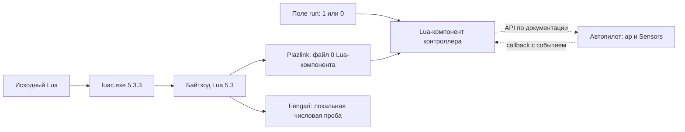

# Исследование прошивки Pioneer и исполнения Lua

Дата начала: 2026-09-15. Цель: восстановить проверяемую модель исполнения Lua для web-simulator.

## План и критерии завершения

1. **Инвентаризация.** Найти образы прошивки, компиляторы, библиотеки станции; записать размеры, SHA-256 и версии. Версию файла не считать версией подключённого контроллера.
2. **Формат прошивки.** Проверить заголовки, энтропию, структуру блоков, строки и код обновления станции. Установить, доступен ли машинный код непосредственно или контейнер требует распаковки/расшифровки. Высокая энтропия сама по себе не доказывает шифрование.
3. **Путь Lua до контроллера.** Разобрать компилятор и код загрузки/запуска/остановки в Java-библиотеках станции. На локальном минимальном скрипте проверить формат байткода и параметры чисел.
4. **Связь VM и автопилота.** При доступном открытом образе искать регистрацию API, диспетчер событий, таймеры и задачи RTOS. Если образ зашифрован и ключ/открытый образ недоступен, документировать границу и исследовать доступные протокольные классы, официальную документацию и примеры.
5. **Матрица совместимости.** Сопоставить найденное с Lua-рантаймом симулятора: язык, типы, callback, sleep, таймеры, события, команды, датчики, GPIO. Для каждого вывода указать источник и уровень подтверждения.
6. **Проверки на устройстве.** Подготовить отдельные короткие пробы без команд моторов для оставшихся вопросов. Выполнение на контроллере — отдельный этап после установления его текущей версии и сохранения установленного скрипта; результаты не заменять догадками.

## Правила доказательств

- «Код станции» подтверждает поведение станции и формат её запросов, но не внутреннюю реализацию прошивки.
- «Документация/пример» описывает контракт; реальные времена и порядок конкурентных событий требуют измерений.
- «Гипотеза» требует отдельной проверки и не должна автоматически менять поведение симулятора.
- Локальный эксперимент компиляции выполняется на компьютере. COM10 и обновление прошивки для статического анализа не нужны.

## Ход исследования

Выполнены этапы 1–3 и сопоставление доступного контракта на этапах 4–5. Для этапа 6 подготовлены и скомпилированы пробы. **Образы полётного контроллера не расшифрованы. Адреса внутренних Lua-функций, реализация очереди и задачи RTOS не восстановлены. Эксперименты на физическом устройстве не выполнялись.**

Сборщик исследовал **30 вхождений образов, 18 уникальных SHA-256**, включая содержимое JAR, и сформировал дизассемблирование **16 Java-классов**. Это Java-байткод программ станции, а не машинные инструкции прошивки.

Уточнение предыдущего ответа: файл `C:\PioneerStation\version.properties` содержит **1.11.0**. Его нельзя приписывать второй установке; **1.6.7178** — обозначение найденной прошивки/параметров, а не доказанная версия Pioneer Station или подключённого аппарата.

## 1. Образы и граница расшифровки

| Образ контроллера | Место | Размер | Энтропия, бит/байт |
|---|---|---:|---:|
| Base V1.2, 1.5.6173 | `C:\PioneerStation\firmware` и firmware-JAR | 964576 | 7.999830 |
| Education V12, 1.6.7178 | `geoskan/Прошивка/Плата Пионер` в репозитории | 978592 | 7.999820 |
| Pioneer Base, 1.6.10332 | `logic-0.9.174794.jar!/firmware/autopilot/PioneerBase/` второй станции | 719680 | 7.999741 |

SHA-256 наиболее подходящего старого образа 1.6.7178:

```text
dd157981d0c7abf9b7cd6a424aef2c5923e634c9e68732b399474c613b8af3a7
```

SHA-256 образа Base 1.6.10332:

```text
8b55a6df2013f7e8af4cd97a83253eba3f7649ee95684beba5b31d51be56b82b
```

У этих трёх образов размер кратен 16; нет повторяющихся выровненных 16-байтовых блоков, заголовков ELF/ZIP/gzip/xz в начале, сигнатур Lua 5.3 и найденных поиском строк Lua API. Проверка по ограниченной эвристике таблицы векторов STM32 также ничего не нашла. Это согласуется с шифрованным контейнером, но **не устанавливает алгоритм, режим AES, ключ или отсутствие сжатия внутри**. Отсутствие сигнатуры в начале не исключает нестандартный контейнер.

В новом JAR найден открытый `MiniLoaderAll.bin`, однако его заголовок `LDR ` и строки Rockchip/U-Boot относятся к другой системе. Он не является найденным открытым загрузчиком полётного контроллера Пионера Базового. Каталоги `PioneerBase` и `PioneerBaseOld` содержат побайтно одинаковый образ 1.6.10332.

Проверен путь обновления старой станции:

1. `FlashingWizard`: `URL.openStream()` → `IOUtils.toByteArray()` → `new FlashingJob(port, bytes, name)`.
2. `FlashingJob.lambda$3`: `Arrays.copyOfRange(file, offset, end)` отправляет содержимое файла блоками до **48 байт** через `FileWriteRequest`.
3. `FlashingJob.lambda$4`: CRC32 считается непосредственно по исходному массиву `file` и сопоставляется с ответом устройства.

В этой цепочке расшифровки на ПК нет. Новая станция имеет отдельный путь `PioneerUploadFirmwareService`: передаёт полученный `byte[]` как файл №6 компонента `UavMonitor`. Это другой файл и другой компонент, чем Lua-скрипт. Найденный `FirmwareValidatorImpl` проверяет существование, ненулевой размер и ожидаемое имя файла; это не дешифратор.

Практический вывод: установка дизассемблера сама по себе не откроет эти образы. Следующий обоснованный шаг для исследования машинного кода — получить открытый ELF/BIN, исходники загрузчика или сведения о формате от производителя, либо выполнить разрешённое недеструктивное чтение flash через отладочный интерфейс, если защита платы это допускает. Снятие защиты со стиранием памяти не является способом сохранить исследуемый экземпляр. На этом этапе ключ или открытый образ контроллера не найден.

## 2. Действительный путь Lua

`LuaScriptUploadCommand.compile()` вызывает собственный `compileExternal()`. Он запускает **`./tools/luac.exe -o <временный файл> -s -`**, передавая исходный Lua через stdin. `-s` удаляет отладочную информацию из результата. Наличие `LuaCompiler.compileInternal()` и LuaJ 3.0.1 в другом плагине не означает, что этот путь загрузки использует LuaJ.

Проверенный локальный компилятор:

```text
C:\PioneerStation\tools\luac.exe
Lua 5.3.3
SHA-256: 9675f0950826d98dc47d83bdf7d93768a77d92f9ae22735686f8a4f848084e06
```

Компиляция короткой числовой пробы дала заголовок:

```text
1b 4c 75 61 53 00 19 93 0d 0a 1a 0a 04 04 04 04 08
78 56 00 00 00 00 00 00 00 28 77 40
```

По структуре заголовка Lua 5.3: little-endian, `int=4`, `size_t=4`, инструкция=4, `lua_Integer=4`, `lua_Number=8` байт. Дробные числа здесь **64-битные**, а не float32. Это измеренный формат данного компилятора; совпадение с установленной прошивкой ещё требует её идентификации.

`Plazlink1_4LuaScriptBinding$LuaScriptUploadHandler` передаёт скомпилированные байты в **файл №0 компонента Lua** через `ComponentFileWriteCommand`. Индекс компонента берётся из описания устройства, его нельзя жёстко считать фиксированным. `UploadLuaScriptFLJob` подтверждает файл №0 и тот же путь быстрой загрузки.

Для Lua используется `Plazlink1_4FileUploader`: максимум **40 байт** в сообщении и до четырёх отправляемых блоков в окне. Это не те 48 байт, которые использует старый загрузчик прошивки.

`LuaScriptStartHandler` находит поле с именем **`run`** и записывает `Int8(1)`; `LuaScriptStopHandler` записывает `Int8(0)`. Эти действия управляют жизненным циклом Lua-компонента. Они не являются `ap.push(...)` и не определяют, что делает загруженный скрипт после запуска.

В модели второй станции имеются поля `run`, `status`, `memoryUsage`. Их наличие в клиентской модели подтверждено; единицы `memoryUsage`, коды `status` и доступность этих полей на конкретной старой прошивке пока неизвестны.



Сплошные стрелки до устройства восстановлены из клиентского кода. Пунктир описывает внешний контракт API; внутренние функции контроллера из прошивки не извлечены.

## 3. Проверка совместимости байткода

Скомпилирован и затем загружен непосредственно в установленный пакет Fengari скрипт:

```lua
return 1.5, 16777217.0, 2147483647, math.maxinteger, 1 << 31, 7 // 2
```

Загрузка и выполнение завершились с кодами `0` / `0`. Результаты: `1.5`, `16777217.0`, `2147483647`, `2147483647`, `-2147483648`, `3`; первые два значения имеют дробный подтип Lua, остальные — целый. Следовательно, уже можно сравнивать один и тот же байткод, полученный станцией, на уровне выбранных операций языка.

Дополнительно **все 12 Lua-файлов из `C:\PioneerStation\examples`** успешно скомпилированы этим компилятором; все 12 бинарных результатов приняты загрузчиком Fengari с кодом `0`. На этом шаге выполнялась только загрузка структуры байткода, без вызова скриптов. Это расширяет проверку формата на функции, замыкания и таблицы реальных учебных программ, но не проверяет их аппаратное поведение.

Это проверка VM на ПК. Она не проверяет `ap`, датчики, планировщик симулятора, доступность стандартных библиотек на борту, лимиты памяти, сборку мусора или реальную точность времени. Подменять эти проверки успешной арифметикой нельзя.

## 4. Контракт API и матрица расхождений

Официальный контракт сообщает: `Timer.stop` сохраняет уже поставленный в очередь вызов; для однократных таймеров действует лимит 16 ожидающих вызовов; `deltaTime` задаёт поправку к часам навигации, а `time` — время включения. `sleep` приостанавливает скрипт. `callAt`/`callAtGlobal` используют абсолютные часы. Время перехода в `goToLocalPoint` влияет на движение. Проверки камеры имеют состояния −1/0/1. HSV описан в градусах и процентах, `range` может вернуть несколько значений. Источники: [справочник API](https://docs.geoscan.ru/pioneer/programming/lua/lua.html), [часы и sleep](https://docs.geoscan.ru/pioneer/programming/lua/sections/0000_general.html), [зафиксированный исходник документации](https://github.com/GeoScan-Pioneer/pioneer-doc/blob/077f61899f0433479dfe8902473ab350fd75ea86/programming/lua/lua.rst).

| Приоритет | Наблюдение в симуляторе | Что устанавливает исследование | Действие |
|---|---|---|---|
| P0 | `runtime.ts` создаёт отдельную coroutine для каждого timer/event callback | Такая конкурентность не доказана кодом контроллера. Текст о блокирующем sleep не описывает все очереди | Проба 03 и затем модель диспетчера |
| P0 | `Timer.stop()` немедленно ставит `running=false` | Отложенный callback не моделируется | Проба 02: уточнить, когда вызов уже считается поставленным в очередь |
| P0 | `timers.ts` не ограничивает число `callLater` | Заявленный лимит отсутствует в реализации | Проба 04, затем лимит и поведение отказа |
| P0 | Порог задержки — 0.05 с | Штатный `example_led.lua:87` запрашивает 0.003 с; это не доказывает аппаратную точность 3 мс, но фиксирует входной контракт | Измерить частоту; не заменять порог догадкой |
| P1 | `deltaTime()` всегда возвращает 0.05 | Значение используется как константа вместо модели синхронизации | Развести часы симуляции и поправку навигации |
| P1 | `launchTime()` всегда 0; `current_time` сбрасывается в `state-drone.ts` | Часы запуска и включения не представлены независимо | Повторный запуск пробы 01 без отключения питания |
| P1 | `Timer.callAt`, `Timer.callAtGlobal` отсутствуют в bootstrap | Справочник симулятора рекламирует методы, которых нет | Добавить после определения модели часов |
| P1 | `autopilot.ts` читает четвёртый аргумент точки только для лога | Время перехода не передаётся модели движения | Реализовать проверяемую семантику задания времени |
| P1 | `camera.checkRequestShot()` возвращает 0 при ожидании и 1 после него | Коды и смысл результата расходятся с контрактом | Отдельные состояния запроса/успеха/ошибки |
| P1 | `leds.ts` интерпретирует HSV как 0..1; bootstrap даёт только `Ledbar.fromHSV` | Требуется проверка шкал и глобальной формы `fromHSV` | Стендовая проба API перед изменением |
| P1 | `Sensors.lpsYaw`, `Sensors.altitude` отсутствуют; `range` даёт одно значение | Поверхность API и число возвратов неполны | Проба 01; профиль подключённых датчиков |
| P1 | `Ev` содержит жёстко заданные числа | Документация задаёт имена, но найденные материалы не подтверждают все числовые значения | Считать таблицу констант на борту |
| P2 | UART/SPI возвращают пустые строки/нули | Это заглушки, не модель периферии | Отдельные модели устройств после ядра исполнения |

Исходники для проверки: `public/modules/lua/{timers,runtime,setup-script,autopilot,sensors,leds,api-constants}.ts`, `public/modules/lua/hardware/{io,camera}.ts`, `public/modules/core/state-drone.ts`. Порядок событий, частота опроса, обработка пропущенных тиков и поведение ошибки callback пока неизвестны.

Наличие пустого `callback` во всех учебных примерах не доказывает блокировку последующих полётных команд при его отсутствии. Текущий `mission-guard.ts` пропускает команды; этого правила также нельзя считать восстановленным из прошивки без отдельного измерения. Проба 05 проверяет только жизнь VM/таймера, не полётные команды.

## 5. Следующий этап на устройстве

Подготовлены [пять проб и инструкция наблюдений](../tools/pioneer-lua-probes/README.md). Все пять проверены через `luac -p`, но **результатов запуска на аппарате ещё нет**. Загрузка каждой пробы заменяет скрипт на устройстве: необходима резервная копия и идентификация версии до такого этапа. `print` как доступный канал наблюдения пока не установлен; ключевые пробы используют светодиоды.

Порядок: версия/модель/резервная копия → наличие API и значения констант → new/start/stop → sleep и порядок обработчиков → лимит таймеров → повторный запуск и часы → ошибки callback/ограничения VM → полётные события в отдельном испытании. Название COM-порта в Windows само по себе не доказывает модель контроллера; в этом расследовании обмен с COM10 не выполнялся.

Для открытого образа будущий план анализа: установить архитектуру и карту памяти по заголовкам/таблице векторов; найти строки API и перекрёстные ссылки; восстановить таблицы регистрации C-функций Lua; определить загрузчик байткода и обработчик ошибок; проследить очереди `ap.push`, `callback` и Timer; проверить выводы теми же стендовыми пробами. Адреса и имена внутренних функций сейчас неизвестны и в отчёте не выдуманы.

## 6. Воспроизведение и артефакты

Скрипт [tools/pioneer_lua_research.py](../tools/pioneer_lua_research.py) работает локально, не требует дополнительных Python-пакетов и сохраняет полный `javap`, характеристики образов и результаты компиляции. Команда из каталога web-simulator:

```powershell
& 'C:\Users\serzh\.cache\codex-runtimes\codex-primary-runtime\dependencies\python\python.exe' tools/pioneer_lua_research.py --firmware-root 'C:\Users\serzh\Documents\GitHub\Geoskan-Pioneer-for-students\geoskan\Прошивка' --node 'C:\Users\serzh\.cache\codex-runtimes\codex-primary-runtime\dependencies\node\bin\node.exe'
```

Результат: `.tmp/pioneer-firmware-research/repro/evidence.json` и 16 файлов дизассемблирования рядом. Снимок измерений сохранён в [pioneer-lua-research-evidence.json](pioneer-lua-research-evidence.json); SHA-256 каждого исходного JAR и выбранного класса позволяет проверить, что исследуются те же версии. Бинарные прошивки в отчёт не копируются.

Проверено: сборщик отработал полностью; все 16 классов найдены; пять стендовых проб компилируются; числовой байткод станции загружается и исполняется Fengari; 12 официальных примеров компилируются и загружаются в VM без исполнения. Результат этого этапа — доказательная база и измеримые следующие шаги. Полное воспроизведение поведения контроллера остаётся незавершённым до исследования его планировщика и аппаратных наблюдений.
